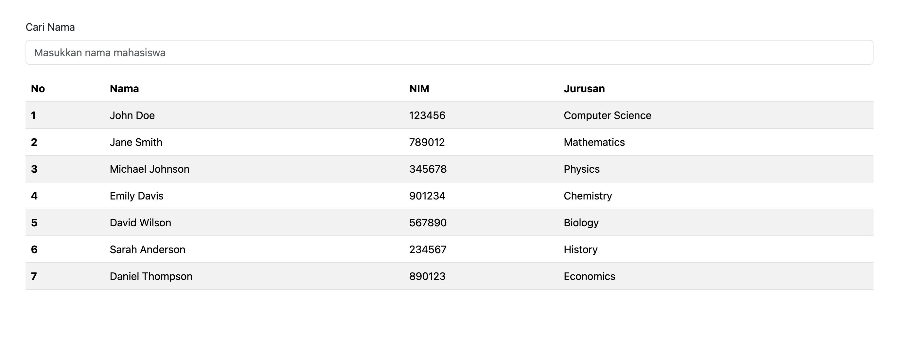
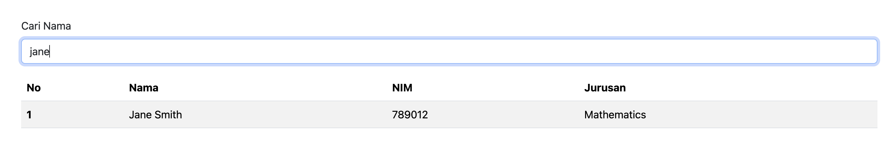

# Tugas 1 - Data Mahasiswa

Proyek ini menampilkan data mahasiswa dari file `data.json` ke dalam tabel Bootstrap dengan fitur pencarian berdasarkan nama.

## Fitur

- Menampilkan data mahasiswa ke tabel secara dinamis dari JSON
- Tabel menggunakan style Bootstrap `table-striped`
- Pencarian nama mahasiswa secara real-time

## Cara Menjalankan

1. Buka folder proyek `tugas1`.
2. Jalankan dengan local server (misalnya VS Code Live Server) agar `fetch("data.json")` bisa dibaca browser.
3. Buka halaman `index.html`.

## Hasil Tampilan

### Tabel Awal (Tanpa Pencarian)

### Tabel Setelah Pencarian

